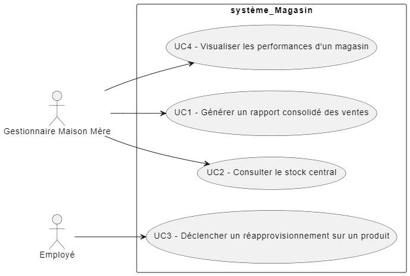
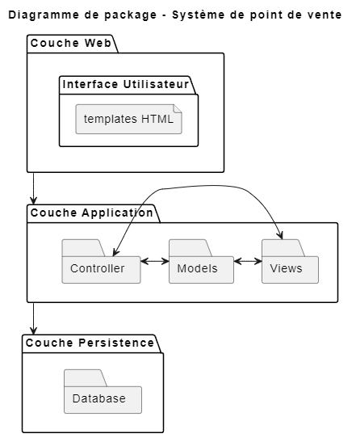
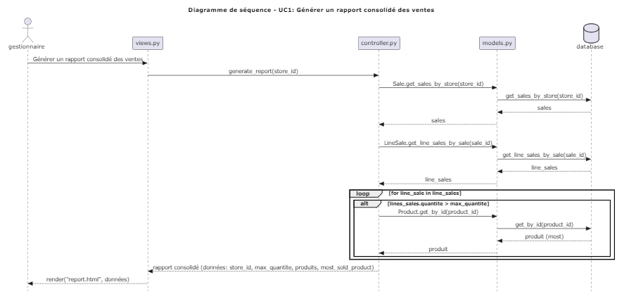
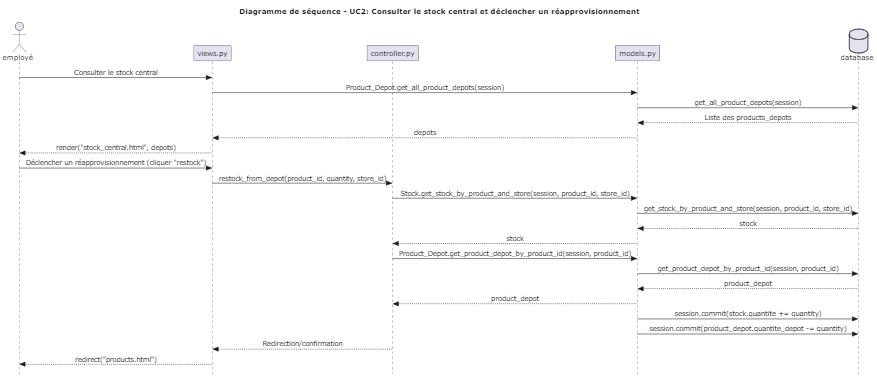
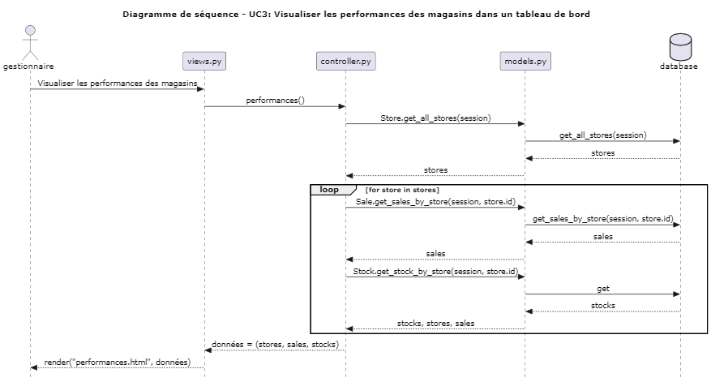

Template tirée : https://www.dokchess.de/en/00_overview/ 

Introduction and Goals
======================

Requirements overview
---------------------
Le but de cette exercice est de développer une système de point de vente pour une entreprise contenant des magasins, permettant également la gestion des magasins et de leurs produits. 

Fonctionnalités essentielles:
- Rechercher un produit
- Acheter un produit
- Générer un rapport consolidé des ventes
- Consulter le stock central 
- Déclencher un réapprovisionnement 
- Visualiser les performances des magasins dans un tableau de bord

---------------------

Quality Goals 
-------------

| Attributs de qualité   | Motivation / Description                           |
| -----------------------| -------------------------------------------------- |
| Maintenabilité         | L'utilisation de tests et l'architecture 3-tier facilite la compréhension du système, permettant aux nouveaux développeurs de s'adapter au code rapidement. Les bugs sont rapidement corrigés en conséquence.                                          |
| Évolutivitité            | Le système est capable de s'adapter facilement à de nouveaux besoins et à une agumentation du nombre d'utilisateurs , et ce, sans changement majeurs de code.                               |
| Utilisabilité          | Le système présente une interface claire et simple, et ce, sans erreurs majeurs qui pourrait perturbé l'expérience du client. Les cas d'utilisation sont clairement divisé dans le UI.               |
| Simplicité         | Le système évite les concepts complexes pour ne pas être lourd. L'ajout de nouvelles fonctionnalités est facile.                                            |

Stakeholders
------------

| Role/Name   | Contact                   | Expectations              |
| ----------- | ------------------------- | ------------------------- |
| Fabio Petrillo      | *Unknown*              | Product Owner   |
| Lojan Arunasalam      | lojan.arunasalam.1@ens.etsmtl.ca                | Responsable de l'architecture du système -- Developpeur du système   |

Architecture Constraints
========================

| Contrainte   | Background ou motivation|
| ----------- | ------------------------- |
| Implémentation en Python       | Le projet est developpé en Python et doit rester en Python, sauf à indication contra9ire. |
| Architecture 3-tiers      |  Le projet doit respecter une séparation de 3 couches claires, soit la couche logique, la couche présentation et la couche de persistance.
| Déploiement sur VM      |  Le projet doit déployer sur la VM fournie via Github Actions et doit pouvoir rouler dans cette VM.

System Scope and Context
========================

Business Context
----------------

| Communication parternaire  | Input - Output |
| ----------- | ------------------------- |
| Employé magasin      | Un employé peut effectuer une recherche de produit, ou acheter un produit. Également, si le stock d'un produit en local est proche de finir, il peut déclencher un réapprovisionnement. Une communication entre ces deux parties est donc requise. |
| Gestionnaire       |  Un gestionnaire peut effectuer une demande de rapport de ventes pour chaque magasin. Également, il peut visualiser les performances des magasins. Une communication entre ces deux parties est donc requise.
| Base de données      |  Le système persiste les données effectués par les requêtes des utilisateurs

Technical Context
-----------------

*Mapping Input/Output to Channels*
| Channels  | Input - Output |
| ----------- | ------------------------- |
| Browser      | Reçoit en input des requêtes HTTP venant des utilisateurs et effectue le rendering des HTML en conséquence.  |
| Web Server       | Reçoit en input les requêtes HTTP du browser et exécute des requêtes vers la base de données|
| PostgreSQL     |  Reçoit en input les requêtes en TCP/IP et output les données|

Solution Strategy
=================

| Attributs de qualité   | Approche pour atteindre cette qualité |
| -----------------------| -------------------------------------------------- |
| Maintenabilité         | Utilisation d'une architecture 3-tier pour séparer les responsabitlités. Facilite la compréhension du système |
| Évolutivitité            |Utilisation d'une architecture 3-tiers permet aux couches d'évoluer, et peut évoluer vers une architecture n-tiers|
| Utilisabilité          | Interface utilisateur simple avec les cas d'utilisations sur une page différente|
| Simplicité         | Limiter la complexité technique: ne pas overengineer

Building Block View
===================

**Level 1** is the white box description of the overall system together
with black box descriptions of all contained building blocks.

**Level 2** zooms into some building blocks of level 1. Thus it contains
the white box description of selected building blocks of level 1,
together with black box descriptions of their internal building blocks.

N/A

**Level 3** zooms into selected building blocks of level 2, and so on.

N/A

Whitebox Overall System
-----------------------

| **Nom (boîtes noires)**             | **Responsabilité**                           |
| -------------------- | -------------------------------------------- |
| Interface Utilisateur         |  Afficher les templates HTML et interagir avec l'utilisateur                              |
| Views.py          |  Rendering de l'HTML                             |
| controller.py          |  Couche logique pour les besoins métiers                              |
| models.py          | Représentent les entités domaines                             |
| Base de données          |  Persistent les données                              |

### Interface Utilisateur 

- But: Permet l'interaction entre le client et le système 
- Interface: HTTP - Il doit être réactive et facile à utiliser 

### views.py

- But: Permet de rediriger les requêtes HTTP vers les rendering appropriés
- Interface: HTTP - Fonctions pythons - Il doit être mince

### controller.py

- But: Effectue la logique pour atteindre les besoins métiers, les uses cases. 
- Interface: Fonctions pythons - Il doit être robuste

### models.py

- But: Représentent les entités métiers 
- Interface: Class python - Il doit garantir l'intégrité des données

### Base de données

- But: Stockent les données
- Interface: Requêtes SQL via ORM - Il doit respecter les principes ACID

Runtime View 
============

&lt;Runtime Scénario 1 - UC1 &gt;
--------------------------

&lt;Runtime Scénario 2 - UC2&gt; 
--------------------------

&lt;Runtime Scénario 3 - UC3&gt; 
--------------------------

Deployment View 
===============

Ce diagramme représente le déploiement du système. On 

Cross-cutting Concepts 
======================

N/A

Design Decisions 
================

**Contents.**

Voir ADRs sous la section docs/ADR

Quality Requirements 
====================

N/A

Quality Scenarios 
-----------------

N/A

Risks and Technical Debts 
=========================

| **Risques**             | **Description**                           |
| -------------------- | -------------------------------------------- |
| Pas d'authentification | Le système ne requis pas d'authentification pour y accéder |
| Sécurité négligeable | Le système ne contient pas de mesures sécuritaire pour contrer les attaques |

Glossary 
========

N/A

Lien vers les autres labs
=========================
- Lien vers lab0 :  https://github.com/LojanArunasalam/LOG430-Lab0 
- Lien vers lab1: https://github.com/LojanArunasalam/LOG430-Lab1 
- Lien vers lab2: https://github.com/LojanArunasalam/LOG430-Lab2 
